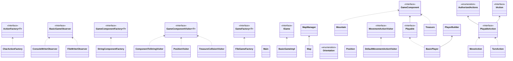

# Exercice pratique - La carte aux trésors 
### [AutoGenerated markdown - Yann Guillemaud]

## Diagramme de classe utilisé

```mermaid
classDiagram
direction BT
class ActionFactory~T~ {
<<Interface>>

}
class AuthorizedActions {
<<enumeration>>

}
class BasicGameImpl
class BasicGameObserver {
<<Interface>>

}
class BasicPlayer
class CharActionFactory
class ComponentToStringVisitor
class ConsoleWriterObserver
class DefaultMovementActionVisitor
class FileGameFactory
class FileWriterObserver
class GameComponent {
<<Interface>>

}
class GameComponentFactory~T~ {
<<Interface>>

}
class GameComponentVisitor~T~ {
<<Interface>>

}
class GameFactory~T~ {
<<Interface>>

}
class IAction {
<<Interface>>

}
class IGame {
<<Interface>>

}
class Main
class Map
class MapManager
class Mountain
class MoveAction
class MovementActionVisitor {
<<Interface>>

}
class Orientation {
<<enumeration>>

}
class Playable {
<<Interface>>

}
class PlayableAction {
<<Interface>>

}
class PlayerBuilder
class Position
class PositionVisitor
class StringComponentFactory
class Treasure
class TreasureCollisionVisitor
class TurnAction

PlayableAction  -->  AuthorizedActions 
BasicGameImpl  ..>  IGame 
BasicPlayer  ..>  Playable 
CharActionFactory  ..>  ActionFactory~T~ 
ComponentToStringVisitor  ..>  GameComponentVisitor~T~ 
ConsoleWriterObserver  ..>  BasicGameObserver 
DefaultMovementActionVisitor  ..>  MovementActionVisitor 
FileGameFactory  ..>  GameFactory~T~ 
FileWriterObserver  ..>  BasicGameObserver 
Map  -->  MapManager 
Mountain  ..>  GameComponent 
MoveAction  ..>  PlayableAction 
Playable  -->  GameComponent 
PlayableAction  -->  IAction 
BasicPlayer  -->  PlayerBuilder 
PositionVisitor  ..>  GameComponentVisitor~T~ 
StringComponentFactory  ..>  GameComponentFactory~T~ 
Treasure  ..>  GameComponent 
TreasureCollisionVisitor  ..>  GameComponentVisitor~T~ 
TurnAction  ..>  PlayableAction 
```
